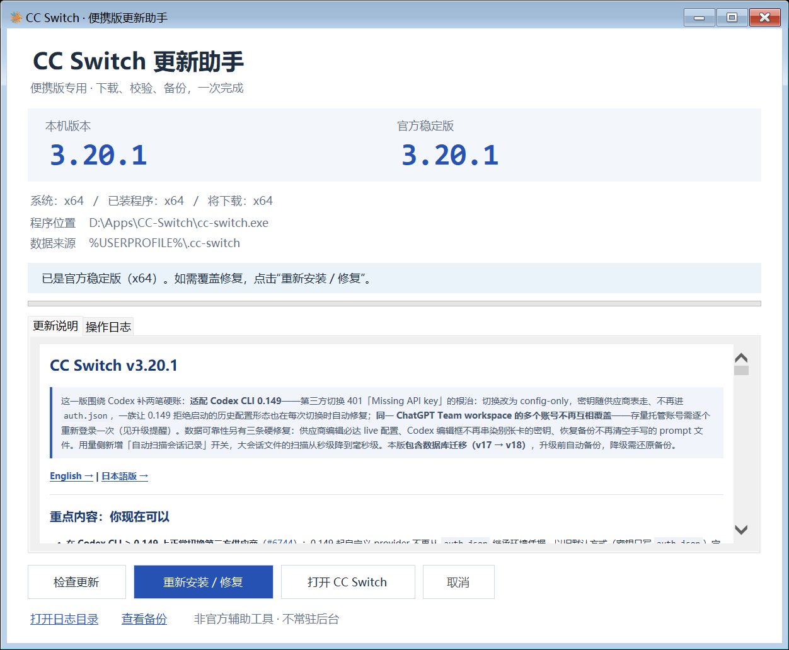

# CC Switch 便携版更新助手

把 Windows 便携版的「打开 GitHub → 找包 → 下载 → 校验 → 备份 → 替换」放进一个中文窗口。

**打开即检查更新 · Markdown 更新说明 · 同版本修复 · 按系统架构选包**

> 本工具是独立辅助项目，与 [CC Switch](https://github.com/farion1231/cc-switch) 官方没有隶属关系。不包含 CC Switch 本体。

[下载最新版](https://github.com/cruz0407/cc-switch-portable-updater/releases/latest) · [版本记录](CHANGELOG.md)



## 快速使用

1. 从 [Releases](https://github.com/cruz0407/cc-switch-portable-updater/releases/latest) 下载 `CCSwitch-Update-Helper.exe`，或下载便携 ZIP 后解压。
2. 把助手放到 `cc-switch.exe`、`portable.ini` **同一目录**。
3. 双击助手：窗口显示后会自动检查一次 **CC Switch 官方稳定版**，不用再点检查按钮。
4. 有新版时点击 **下载并更新**；同版本需要覆盖时点击 **重新安装 / 修复**。
5. 下载与校验完成后，确认更新，并按提示从系统托盘正常退出 CC Switch。
6. 助手备份数据和旧程序，替换主程序，然后尝试重新启动 CC Switch。

```text
CC-Switch/
├── cc-switch.exe               ← 你现有的 CC Switch
├── portable.ini                ← 你现有的便携标记
└── CCSwitch-Update-Helper.exe   ← 新增的助手
```

**自动检查不等于自动安装。** 本工具不自动下载、不自动覆盖、不添加开机启动或定时任务；保留手动检查、取消和重试。自动检查针对 CC Switch，而不是助手自身。

## 主要功能

| 功能 | 说明 |
| --- | --- |
| 启动自动检查 | 窗口显示后异步检查一次；失败可重试，不阻塞窗口 |
| Markdown 更新说明 | 支持标题、粗体、斜体、引用、列表、表格、代码、分隔线和 HTTPS 链接 |
| 按系统架构下载 | 分别显示系统、已安装程序与目标架构；不跟随装错的程序选错包 |
| 同版本修复 | 最新版本也可重新下载并覆盖；仍保留校验、备份和确认 |
| 下载校验 | 校验官方文件大小、SHA-256、ZIP 结构、程序产品名、版本和 PE 架构 |
| 安全替换 | 只原子替换 `cc-switch.exe`，不先删除旧程序，不覆盖旁边的其他文件 |
| 数据备份 | 支持默认数据路径及官方自定义目录设置，备份前要求退出所有 CC Switch 实例 |
| DPI 布局 | 标题和状态按内容计算高度，长路径可复制，缩小窗口不会遮住按钮 |

## 更新说明的安全边界

- Markdown 在本机转换，不依赖外部渲染服务、脚本或 CDN。
- 原始 HTML 作为文本处理，远程图片不自动加载。
- 点击 HTTPS 链接后先确认，再交给系统默认浏览器打开；预览不加载外部网页。
- 使用 Windows 内置 `WebBrowser` 控件，不需要另装 WebView2。
- 实现的是适合发布说明的 Markdown 子集，并非完整 CommonMark / GitHub Flavored Markdown 引擎。复杂嵌套语法、任意 HTML 和远程媒体不在支持范围内。

## 备份与隐私

- 备份位置：`%LOCALAPPDATA%\CCSwitchUpdateHelper\backups`。
- 备份包含旧主程序、`portable.ini` 和当前数据目录，跳过顶层 `logs`、`backups`、`skill-backups`，不重复备份历史记录。
- 备份权限限定为当前用户、SYSTEM 和管理员。备份可能含 API 密钥，请不要公开分享。
- 只在本地复制配置与数据库，不上传配置内容。
- 日志与临时下载放在助手旁边的 `update-helper-data`；正常结束会清理本次临时下载。
- 新版本启动后可能迁移数据库，所以 **不支持降级覆盖、不自动恢复旧数据库**。需要手动恢复时先阅读备份中的恢复说明。

## Release 文件

| 文件 | 用途 |
| --- | --- |
| `CCSwitch-Update-Helper.exe` | 直接运行的 Windows 助手 |
| `CCSwitch-Update-Helper-v1.3.0-Windows-Portable.zip` | **包含 EXE**、中文 README 和版本记录的便携 ZIP |
| `SHA256SUMS.txt` | 上述 EXE 和 ZIP 的 SHA-256 校验值 |
| GitHub 自动生成的 Source code | 对应 Release 标签的源代码 |

程序未做代码签名。可在 PowerShell 中校验后与 `SHA256SUMS.txt` 比较：

```powershell
Get-FileHash .\CCSwitch-Update-Helper.exe -Algorithm SHA256
```

## 从源码构建

需要 Windows、.NET Framework 4.8 和系统自带的 C# 编译器；不需要 Node.js、Python、.NET SDK 或 NuGet 包。

```powershell
# 在项目目录执行，默认输出到项目 dist 目录
powershell -NoProfile -ExecutionPolicy Bypass -File .\build.ps1 -Test

# 可指定独立输出目录，避免覆盖正在运行的助手
powershell -NoProfile -ExecutionPolicy Bypass -File .\build.ps1 -OutputDirectory .\dist-candidate
```

测试使用临时 EXE 和数据夹，不安装或替换实际 CC Switch：

- 29 项核心测试；
- 11 项 Markdown 渲染与安全测试；
- 6 项架构 / 同版本修复回归场景；
- 6 项启动检查、重试、关闭取消和真实 HTML DOM 场景；
- DPI、最小窗口、长提示与长路径布局检查。

已有测试在 Windows x64 上执行；ARM64 包选择有回归测试，但没有 ARM64 实机验证。125% / 200% 使用字号和几何尺寸模拟，不能等同于跨显示器 DPI 实测。

## 已知限制

- 仅处理官方稳定版 Windows x64 / ARM64 Portable 包，不支持 MSI、预发布版和降级。
- 不支持符号链接 / 目录联接目标；数据备份超过 2 GB 则停止。
- 官方摘要缺失、压缩包结构改变、权限不足或文件占用时停止，不猜测覆盖。
- 网络检查使用 Windows 系统代理；检查时限 45 秒，下载时限 10 分钟。GitHub 限流时请稍后重试。
- 备份/替换期间不要重新启动 CC Switch；工具不会强制结束其他程序。
- 如果操作中断电，先保留备份，核对旧/新程序哈希，不要盲目覆盖数据库。
