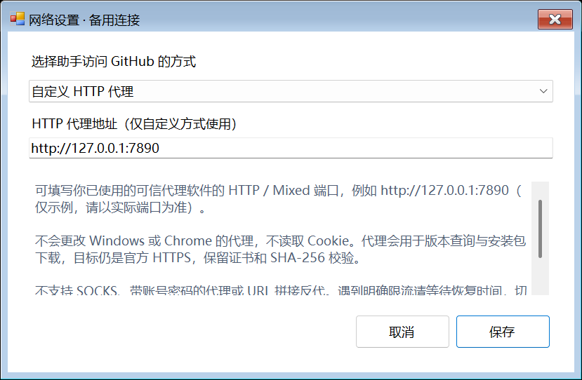

# 网络错误与备用连接（v1.4.0）

## 403 不再统一写成“限流”

助手读取响应头和有限长度的错误 JSON，区分以下情况：

- **配额耗尽**：HTTP 403/429 且 `X-RateLimit-Remaining: 0`；显示可读取的配额和恢复时间。
- **频率限制**：HTTP 429，或 403 明确包含 secondary rate limit / Retry-After；显示等待时间。
- **普通 403**：没有足够证据确认配额耗尽，明确说明不能只凭 403 判断。
- **非 JSON 的 403**：提示可能是代理、网关或访问策略拦截，不把猜测当成已确认原因。
- **401 / 407 / 404 / 5xx**：分别提示认证、代理认证、资源不存在、上游服务问题。
- **连接、DNS、TLS**：尽可能依据底层异常提示；不会关闭证书校验。

恢复时间按本机时区显示完整日期和时区偏移。收到明确限流后，当前助手会话在恢复时间前不发送后续查询/下载请求，不自动切换出口。无有效恢复时间的限流默认至少等待 60 秒。此版等待状态不跨进程持久化，请不要通过反复重启绕过等待。

## 备用方式：网络设置

窗口底部点击 **网络设置**，选择以下方式之一，然后保存并手动检查：

1. **系统代理（默认）**：沿用系统提供的代理设置。
2. **直连**：仅本工具不使用系统代理。可能适合代理故障、而本机可直接连接官方接口的情况。
3. **自定义 HTTP 代理**：填写你已有且信任的代理软件的 HTTP / Mixed 地址。比如 `http://127.0.0.1:7890` 只是示例，必须以自己的实际端口为准。

设置同时用于官方版本查询和附件下载，仅保存到助手旁边的 `update-helper-data/network.json`，不修改 Windows/Chrome 设置，不读取浏览器 Cookie。暂不支持 SOCKS 和代理账号密码。

**这不是 URL 拼接式反代。** 没有内置未知公共镜像，也不允许 `https://mirror.example/https://github.com/...` 这样的反代前缀。未知镜像可能同时改写程序和摘要，所以从同一镜像得到 SHA-256 不足以独立证明来源。

使用 HTTP 正向代理时，GitHub 目标仍是官方 HTTPS 地址，保留系统证书验证、重定向域名白名单、SHA-256 和包结构校验。不要为了让代理通过而关闭安全检查或安装来源不明的根证书。

如果 Chrome 使用浏览器扩展代理，助手不会自动读取该扩展配置；要用同一连接方式，应从你的代理软件中确认对应的 HTTP / Mixed 端口并显式填入。

## 浏览器兜底

点击 **浏览器打开官方发布页**，使用 Windows 默认浏览器查看官方 Releases。如果 Chrome 是默认浏览器，就会用 Chrome。

此入口不依赖 API 成功，不自动下载或覆盖文件，也不放松助手的安装校验。网页能访问并不证明 API 的请求配额或连接路径正常；限流时应等待或使用官方提供的认证机制，而不是自动循环切线路。

## 验证范围

网络分类、响应头恢复时间、错误体限制、跨 client 共享等待、系统/直连/自定义代理 handler、设置读写、设置窗口和限流 UI 都有自动化测试。

自定义代理的实际连通性取决于用户填写的端点。本次没有擅自启动代理服务、更改系统网络配置或使用第三方公共反代。
